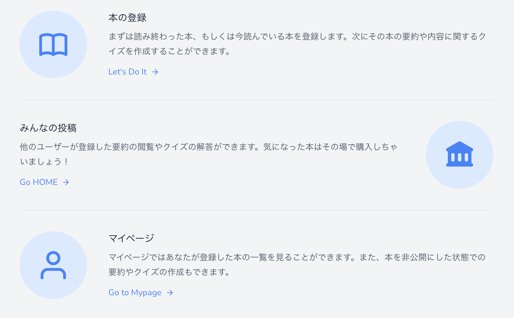
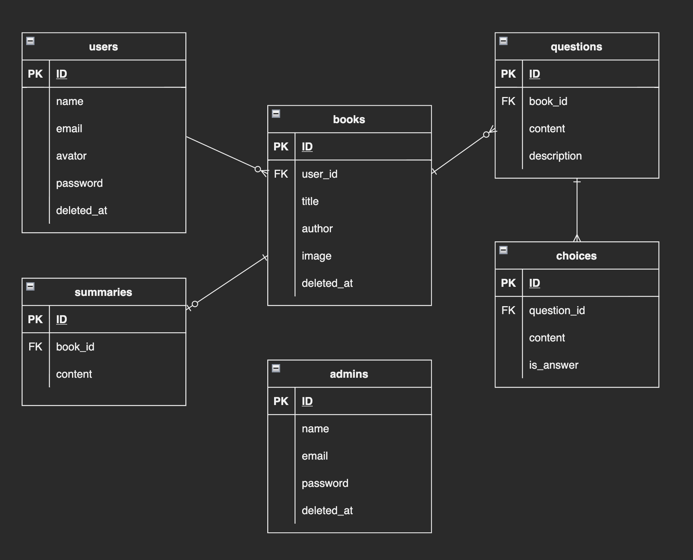

# BookOutput

## 概要
「BookOutput」は本の要約とクイズの投稿サービスです。

### 動機
私（作成者）は年に150冊ほど本を読んでいます。
しかし、読書によって様々な知識や知見を得たとしても、それらが定着しないことが課題でした。
そこで、知識や本の内容を定着させるためにアウトプットが大切であるため、それが可能なサービスを探してみましたがめぼしいものが見つからなかったため自作しようと考えました。

### 主要機能
* 本の登録とそれに紐づく要約とクイズの投稿
* マイページにて、自分が登録した本と非公開にした本の一覧表示
* 他のユーザーが投稿した要約の閲覧や、クイズへの解答

### 詳細機能一覧

#### ユーザー関連
* ユーザーの新規登録、ログイン
* マイページ画面でのユーザー情報の変更（ニックネーム、メールアドレス、アバター画像）
#### 本関連
* 本の登録、編集（タイトル、著者、画像）
* 本に紐づく要約とクイズの作成
* 本を非公開に設定
* 本一覧画面（HOME）にて他のユーザーが投稿した本を見ることができる
* 他のユーザーが投稿した要約の閲覧やクイズに解答することができる

#### マイページ関連
* ユーザー情報の編集（ニックネーム、メールアドレス、アバター画像）
* 自分が登録した本と非公開にした本の一覧表示
* 非公開にした本の公開
* 非公開にした本の完全削除

#### 管理者関連（未実装）
* ユーザーとのメッセージ機能
* ユーザー削除
* ユーザーからの要望、質問の受付

##技術関連
### 使用技術
* PHP 8.0.11
* Laravel 8.77.1
* MySQL 
* Apache
* x-server

### ER図

## 開発過程

### 大変だったこと

### 工夫したこと

## 今後の課題、追加したい機能
